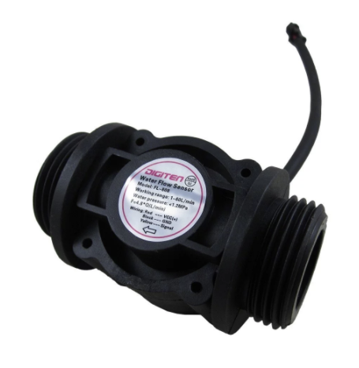

# Hall flow sensor (RPi)

Library for using Hall sensor flowmeter with RPi GPIO pins.

Notes
- Written using Python3+ (includes typing)
- An 'archived' project so comes as-is. Went in another direction using Arduino rather then RPi - so things might be broken. 
- Wss written with a **FS400A** in mind (see below *two-a-penny* on AliExpress), but also tested with **YFB10**. Whatever sensor you have, you'll need the *factor* and *offset* from datasheet. Alterntively calibrate yourself by pouring a known volume through over a set period. You'll have to do it at least twice I guess, for two unknowns.  



## Usage:
You need to permit access to your [RPis GPIO pins](https://www.raspberrypi.org/documentation/usage/gpio/). 


```
pip3 install gpio
```

Then, 

```
from flowsensor import HallFlowSensor, Measurement

# Initialise the sensor
fs = flow_sensor.HallFlowSensor(gpio_pin=4, factor= 4.8, offset = 0)
fs.init_gpio()
```

`factor` and `offset` will depend on the flow sensor model you have. This is for a **FS400AG1** where the manufacturer quotes:
```
pulse frequency = 4.8 Q (L/min)
```

Use `fs.start()` and `fs.stop()` to control

Calling `fs.current_flowrate` will return current flowrate as a `flowsensor.Measurement`

---

### OnFlowSensorChangeListener

You can also add listeners by subclassing `flowsensor.OnFlowSensorChangeListener` and then adding to your `HallFlowSensor` instance using `add_on_change_listener` 
